# STM32 Temperature to PWM Converter

This project demonstrates the implementation of a temperature-to-PWM converter using an STM32 microcontroller and a DS18B20 temperature sensor. The system reads the temperature from the sensor and converts it into a PWM signal with a frequency of 1 kHz. The duty cycle of the PWM signal corresponds to the temperature reading, where 0°C and below results in a 0% duty cycle, and 100°C and above results in a 100% duty cycle.

## Hardware Setup

### Components Used:
- **STM32 Microcontroller**: WeActSTM32G031F6 CoreBoard
- **Temperature Sensor**: DS18B20 in TO-92 package
- **Peripheral**: UART for 1 wire, timer for PWM

### Schematic:
Below is the schematic diagram illustrating the connections on STM32 microcontroller board. 

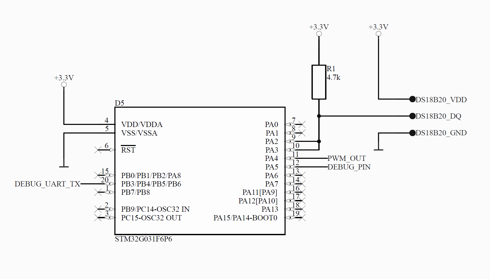

### Prototype:
The following image shows the physical setup of the project, including the STM32 microcontroller and the DS18B20 sensor connected on a breadboard.

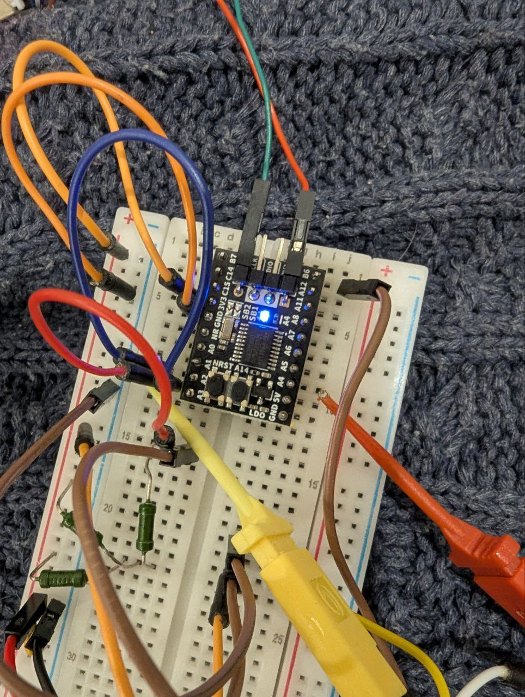 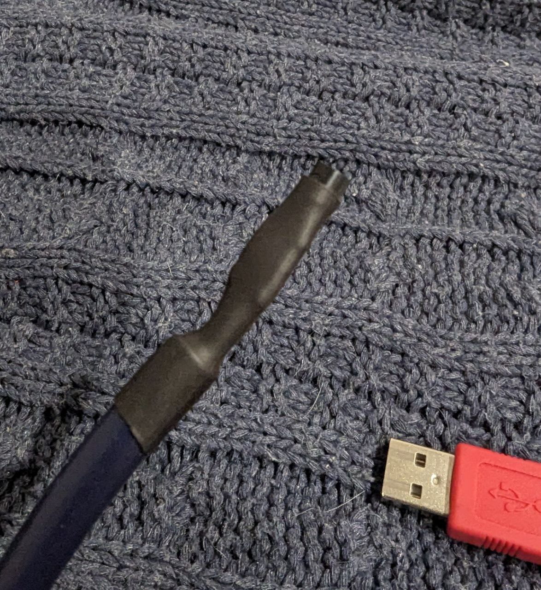

## Software Implementation

### Project Setup:
The project was developed using STM32CubeMX and STM32CubeIDE. The HAL library was used for configuring the peripherals and handling the OneWire communication via UART.

### Features:
- **PWM Generation**: Configured to operate at 1 kHz frequency using timer.
- **Temperature Reading**: Sample rate is 1 Hz with 12 bit temperature value
- **Duty Cycle Calculation**: The duty cycle is calculated based on the temperature reading, with linear mapping between 0°C to 100°C and 0% to 100% duty cycle. Easy to convert HIGH PWM pulse time to temperature value. For example 270 us means 27 degrees.

### Serial Output:
The system outputs the temperature reading to the serial port for monitoring and debugging purposes.

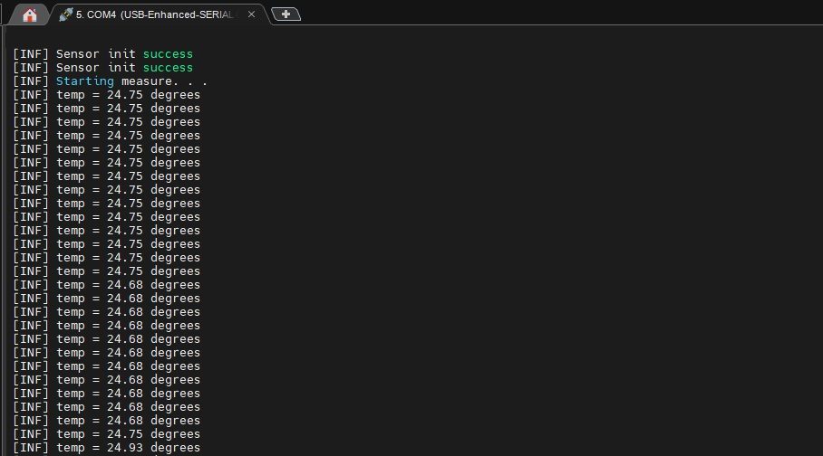

## Experimental Results and Graphs

The following graphs illustrate the performance and behavior of the temperature-to-PWM converter under various conditions.

### 1. All Captures
Experiment took about 10 minutes with several conditions: room temperature -> freezer camera -> under heat gun -> room temperature.

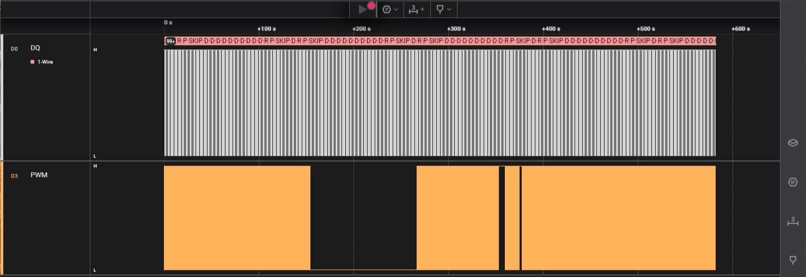

### 2. Room Temperature

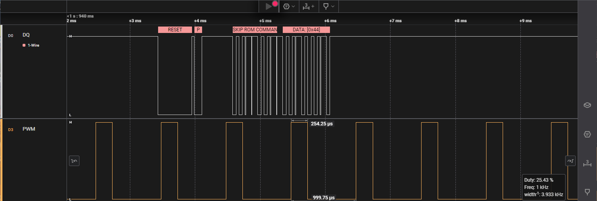

### 3. Zero Pass
Temperature passes below 0°C.

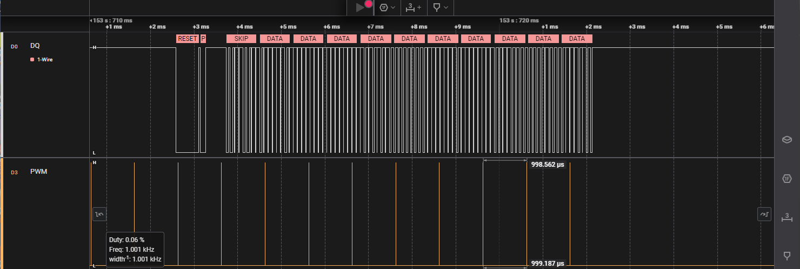

### 4. Zero Interval
Behavior during a below zero temperature interval.

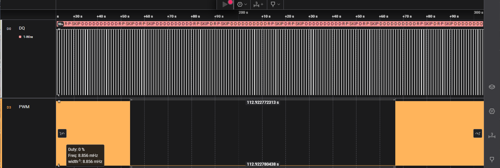

### 5. 100°C Pass Up
Temperature passes above 100°C.

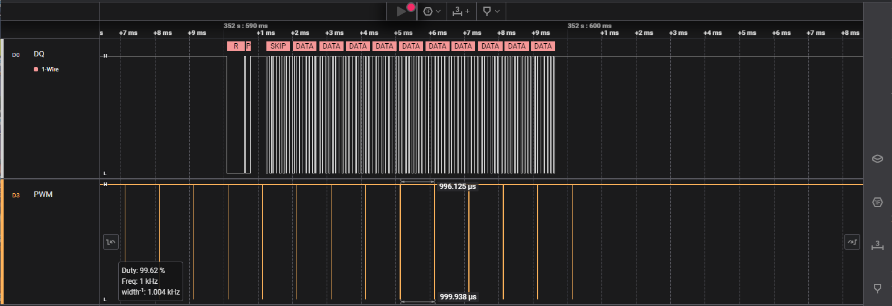

### 6. 100°C Pass Down
Temperature passes below 100°C.

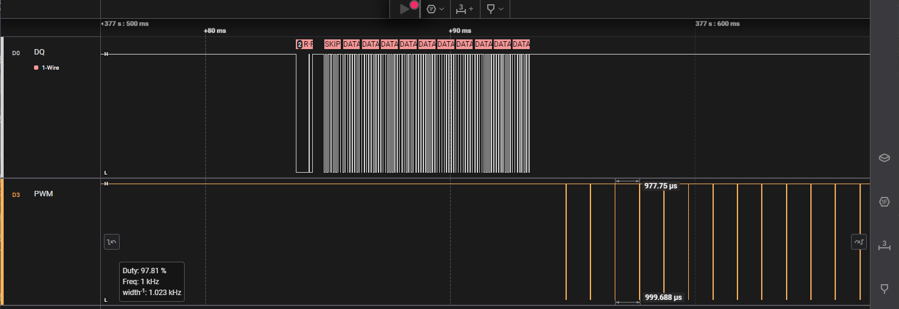

### 7. Around 50°C

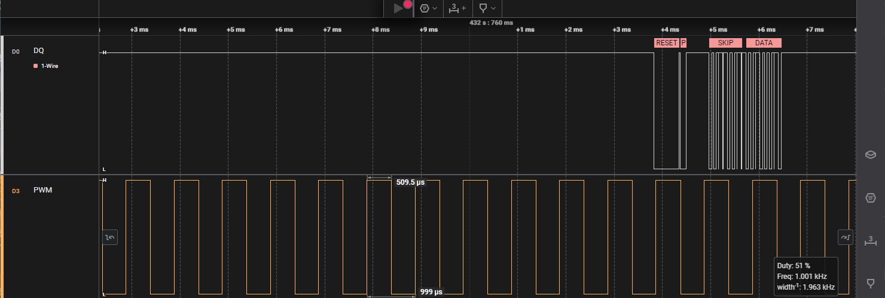

### 8. Back to Room Temperature

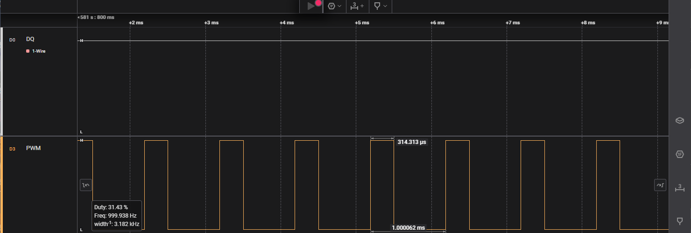

## Analysis
The graphs confirm that the system operates as expected, with the PWM duty cycle scaling linearly with temperature. The system accurately responds to temperature changes, maintaining stability across the entire range from 0°C to 100°C.

